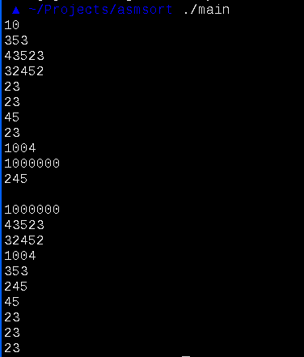

# x86 nasm linux assembly quicksort implementation with random pivot chose

## Demo:

Now, works only with different numbers, sorry:)

## Build and run:

To build it on `x86` linux machine you need to have `make` and `nasm` installed.
For other cases use `qemu`.

To build:

    make

To run:

    ./main

First input elements count in your array, then numbers.
